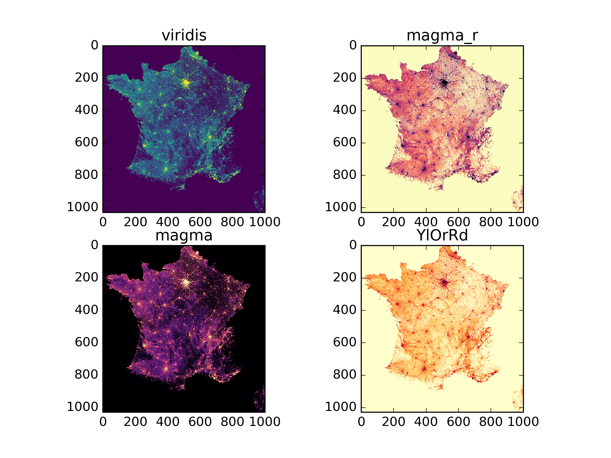

Little project for relatively quick (if you have a nice workstation, this codes take roughly an hour to execute) and very dirty mapping of the population density of France used as a proxy for a comparison between matplotlib [colormaps](http://matplotlib.org/users/colormaps.html).

[Data](http://www.insee.fr/fr/themes/detail.asp?reg_id=0&ref_id=donnees-carroyees&page=donnees-detaillees/donnees-carroyees/donnees-carroyees-km.htm) are coming from the french statistics office (INSEE).

